# КУРСОВА РОБОТА

з курсу: «Об’єктно-орієнтоване програмування»

на тему: «Розроблення програмного забезпечення з використанням об’єктно-орієнтованої парадигми»

# Вступ

У сучасному світі електронна комерція є невід'ємною частиною нашого життя, а промокоди та знижки відіграють важливу роль у привертанні нових клієнтів та збільшенні продажів. Розробка програмного забезпечення для управління та використання промокодів стає все більш актуальною для підприємств та споживачів.

**Актуальність теми**

За останні роки електронна комерція стрімко розвивається, що створює попит на зручні та ефективні інструменти управління промокодами. Підприємства активно використовують промокоди як інструмент маркетингу, а споживачі шукають способи отримання знижок та збереження коштів. Таке програмне забезпечення може значно полегшити процес видачі, використання та відстеження промокодів.

**Потенційні користувачі**

Потенційними користувачами програмного забезпечення є:
1.	Підприємства та магазини: які використовують промокоди для залучення нових клієнтів та збільшення продажів.
2.	Споживачі: які активно шукають промокоди для отримання знижок на покупки у різних інтернет-магазинах.

**Лідери серед програмних аналогів**

На сьогоднішній день існує кілька програмних аналогів, які надають послуги управління та використання промокодів:
1.	[Pokupon](https://pokupon.ua/): один з найпопулярніших сервісів для пошуку та використання промокодів.
2.	[Promo-omo](https://promo-omo.com.ua/): платформа, що пропонує знижки на різноманітні товари та послуги.

# 1.	ФУНКЦІОНАЛЬНІ ВИМОГИ ДО ПРОГРАМНОГО ЗАБЕЗПЕЧЕННЯ

Було виділено три ролі користувачів: «Адміністратор», «Зареєстрований користувач», «Гість».

Опишемо функціональні вимоги кожного типу користувачів

Таблиця 1.1 – Функціональні вимоги користувача з роллю «Адміністратор»

| Ідентифікатор | Функціональні вимоги                           |
|---------------|----------------------------------------------|
| А.1.          | Можливість додавання нових акційних пропозицій до системи. Примітка: не допускати неправильного форматування даних. |
| А.2.          | Можливість редагування існуючих акційних пропозицій. |
| А.3.          | Можливість видалення акційних пропозицій.      |

Таблиця 1.2 – Функціональні вимоги користувача з роллю «Зареєстрований користувач»

| Ідентифікатор | Функціональні вимоги                                               |
|---------------|------------------------------------------------------------------|
| ЗК.1.         | Можливість авторизації на сайті зареєстрованого користувача. Примітка: не можна авторизуватися з невірними даними. |
| ЗК.2.         | Можливість перегляду детальної інформації про акційні пропозиції. |
| ЗК.3.         | Можливість використання промокоду. Примітка: не можна використовувати промокод більше одного разу. |
| ЗК.4.         | Можливість пошуку акційних пропозицій за категоріями або ключовими словами. |

Таблиця 1.3 – Функціональні вимоги користувача з роллю «Гість»

| Ідентифікатор | Функціональні вимоги                                               |
|---------------|------------------------------------------------------------------|
| Г.1.          | Можливість перегляду акційних пропозицій без авторизації. Примітка: не можна отримати та використати промокод без реєстрації/авторизації. |
| Г.2.          | Можливість реєстрації нового облікового запису. Примітка: 1) логін не має збігатися з існуючими; 2) довжина паролю не більше 14 символів; 3) пароль має обов’язково містити латинські літери. |
| Г.3.          | Можливість пошуку акцій за категоріями або ключовими словами.   |

# 2.	МОДЕЛЮВАННЯ ПРЕДМЕТНОЇ ОБЛАСТІ

**2.1	Виділення і опис класів предметної області**

**Клас «Admin» – адміністратор**

Таблиця 2.1 – Виділення характеристик класу «Admin»
| Назва характеристики | Тип значення | Обмеження                                  |
|-----------------------|--------------|--------------------------------------------|
| Електронна пошта      | Рядок        | Не пустий рядок, спеціальна електронна пошта |
| Пароль                | Рядок        | Не пустий рядок, спеціальний пароль        |

Таблиця 2.2 – Виділення поведінки класу «Admin»
| Назва поведінки          | Опис вхідних параметрів                         | Тип значення, що повертається  | Бізнес-правила                                                                                   |
|-------------------------|-------------------------------------------------|--------------------------------|--------------------------------------------------------------------------------------------------|
| Авторизація адміністратора | Логін, Пароль                                    | true/false – успішний вхід/ помилка при вході | 1. Перевірити чи дійсні вхідні дані (Логін, Пароль). 2. Якщо пройдені перевірки, то авторизація успішна. |
| Створити промокод        | ID, Магазин, Категорія, Промокод, Дата закінчення дії промокоду, Фото | true/false – створено промокод/ помилка при створені промокоду | 1. Перевірити чи дійсні вхідні дані (ID, Магазин, Категорія, Промокод, Дата закінчення дії промокоду, Фото). 2. Якщо пройдені перевірки, то створити промокод. |
| Редагувати промокод      | ID, Магазин, Категорія, Промокод, Дата закінчення дії промокоду, Фото | true/false – промокод успішно відредаговано / помилка при редагуванні промокоду | 1. Перевірити чи дійсні вхідні дані (ID, Магазин, Категорія, Промокод, Дата закінчення дії промокоду, Фото). 2. Якщо пройдені перевірки, то зафіксувати зміни. |
| Видалити промокод        | ID                                                | true/false – промокод успішно видалено / помилка при видалені промокоду | 1. Перевірити чи дійсні вхідні дані (ID). 2. Перевірити інформацію промокоду. 3. Якщо інформація вірна, то видалити промокод. |
| Отримати список зареєстрованих користувачів | -                                             | List RegisteredUser           | Повернути список зареєстрованих користувачів.                                                    |
| Отримати список дійсних промокодів         | -                                             | List Promotion                | Повернути список дійсних промокодів.                                                             |
| Отримати список видалених промокодів       | -                                             | List Promotion                 | Повернути список видалених промокодів.                                                           |

**Клас «User» – користувач**

Таблиця 2.3 – Виділення характеристик класу «User»
| Назва характеристики | Тип значення | Обмеження                                                    |
|-----------------------|--------------|--------------------------------------------------------------|
| Електронна пошта      | Рядок        | Не пустий рядок, наявність символу '@', складатися лише з літер латинського алфавіту та бути не менше трьох символів. |
| Пароль                | Рядок        | Не пустий рядок, довжина не більше 14 символів та складатися лише з літер латинського алфавіту.                   |

Таблиця 2.4 – Виділення поведінки класу «User»
| Назва поведінки                                  | Опис вхідних параметрів            | Тип значення, що повертається  |
|-------------------------------------------------|------------------------------------|--------------------------------|
| Авторизація користувача                         | Логін, Пароль                      | true/false – успішний вхід/помилка при вході |
| Перегляд детальної інформації про акційні пропозиції | -                                | -                              |
| Використання промокоду                          | Промокод                           | true/false – успішне використання/помилка |
| Пошук акційних пропозицій за категоріями або ключовими словами | Категорії, Ключові слова | true/false – успішне використання/помилка |

**Клас «Guest» – гість**

Таблиця 2.5 – Виділення поведінки класу «Guest»
| Назва поведінки                                        | Опис вхідних параметрів            | Тип значення, що повертається  | Примітка                                                                                                                                                  |
|-------------------------------------------------------|------------------------------------|--------------------------------|----------------------------------------------------------------------------------------------------------------------------------------------------------|
| Перегляд акційних пропозицій без авторизації           | -                                  | -                              | Гість має можливість перегляду акційних пропозицій без потреби у реєстрації чи авторизації.                                                           |
| Реєстрація нового облікового запису                    | Логін, Пароль                     | true/false – успішна реєстрація/помилка | 1. Перевірити, чи логін не збігається з існуючими. 2. Перевірити, чи пароль не перевищує 14 символів та відповідає вимогам.                      |
| Пошук акційних пропозицій за категоріями або ключовими словами | Категорії, Ключові слова     | true/false – успішне використання/помилка | Гість може здійснювати пошук акційних пропозицій за категоріями або ключовими словами, щоб знайти ті, що відповідають його інтересам.          |

**Клас «Promotion» – пропозиції**

Таблиця 2.6 – Виділення характеристик класу «Promotion»
| Назва характеристики       | Тип значення | Обмеження                               |
|----------------------------|--------------|-----------------------------------------|
| ID                         | Ціле число   | Більше 0                                |
| Магазин                    | Рядок        | Не пустий рядок                        |
| Категорія                  | Рядок        | Не пустий рядок                        |
| Промокод                   | Рядок        | Не пустий рядок                        |
| Дата закінчення промокоду  | Дата         | Дата у майбутньому                     |
| Фото                       |              | Формат зображення .jpg (наприклад)     |

Таблиця 2.7 – Виділення поведінки класу «Promotion»
| Назва поведінки         | Опис вхідних параметрів              | Тип значення, що повертається  | Примітка                                                                                                                                              |
|-------------------------|--------------------------------------|--------------------------------|------------------------------------------------------------------------------------------------------------------------------------------------------|
| Додати промокод         | ID, Магазин, Категорія, Промокод, Дата закінчення дії промокоду, Фото | true/false – створено промокод/ помилка при створені промокоду | 1. Перевірити чи дійсні вхідні дані (ID, Магазин, Категорія, Промокод, Дата закінчення дії промокоду). 2. Якщо пройдені перевірки, то створити промокод. |
| Використання промокоду | Промокод                             | true/false – успішне використання/помилка | 1. Перевірити чи дійсний промокод. 2. Перевірити чи промокод не використовувався раніше.                                                     |
| Редагувати промокод    | ID, Магазин, Категорія, Промокод, Дата закінчення дії промокоду, Фото | true/false – промокод успішно відредаговано / помилка при редагуванні промокоду | 1. Перевірити чи дійсні вхідні дані (ID, Магазин, Категорія, Промокод, Дата закінчення дії промокоду). 2. Якщо пройдені перевірки, то зафіксувати зміни. |
| Видалити промокод       | ID                                   | true/false – промокод успішно видалено / помилка при видалені промокоду | 1. Перевірити чи дійсні вхідні дані (ID). 2. Якщо промокод с таким ID існує, то видалити промокод.                                   |

**2.2	Встановлення зв’язків між класами**

**Діаграма класів**

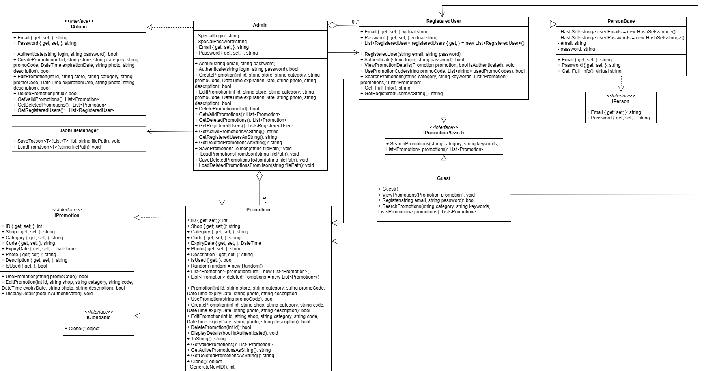

**Зв'язки між класами**

**Admin:**

Цей клас є адміністратором системи. Він має можливість керувати користувачами та промокодами.

Асоціація з класами:

▬	Адміністратор може працювати з користувачами, тому він має асоціацію з класом RegisteredUser.

▬	Також адміністратор відповідає за керуванням промокодами, тому він має асоціацію з класом Promotion.

▬	Адміністратор має можливість завантажувати та зберігати файти в форматі json, тому він має асоціацію з класом JsonFileManager.

Агрегація з класами:

▬	Адміністратор має можливість отримувати списки дійсних та видалених промокодів, тому він має агрегацію з класом Promotion.

▬	Адміністратор має можливість отримувати списки зареєстрованих користувачів, тому він має агрегацію з класом RegisteredUser.

Реалізація інтерфейсу:

Реалізує інтерфейс IAdmin, який містить методи для аутентифікації, додавання, редагування видалення промокодів, отримання списків дійсний та видалених промокодів та списки зареєстрованих користувачів.
 
**Guest:**

Клас представляє гостя або незареєстрованого користувача.

Реалізація інтерфейсу:

Реалізує інтерфейс IPromotionSearch, який містить функціонал пошуку пропозицій.

Взаємодія з іншими класами:

▬	Гість використовує список пропозицій з класу Promotion для перегляду пропозицій, тому він має асоціацію з цим класом

▬	Гість створює нового зареєстрованого користувача і додає його до списку зареєстрованих користувачів, тому він має асоціацію з RegisteredUser.

**RegisteredUser:**

Клас, що представляє зареєстрованого користувача.

Наслідування:

Наслідує від абстрактного класу PersonBase, який містить перевірку правильності пошти та паролю.

Взаємодія з іншими класами:

Клас RegisteredUser використовує список пропозицій з класу Promotion для пошуку пропозицій. Таким чином, він має асоціацію з класом Promotion.

Реалізація інтерфейсу:

Реалізує інтерфейс IPromotionSearch, який містить функціонал пошуку пропозицій.

**PersonBase:**

Абстрактний базовий клас для користувачів.

Властивості та методи:

Містить загальні властивості та методи для користувачів, такі як Email та Password.

Містить методи для введення та перевірки електронної адреси та пароля.

Взаємодія з іншими класами:

Використовується класом RegisteredUser через наслідування.

**Promotion:**

Представляє промокод, який можна використовувати в системі.

Реалізація інтерфейсів:

Реалізація інтерфейсу IPromotion включає наступні властивості: ID, магазин, категорія, промокод, дата закінчення, фото, опис, а також методи створення, видалення та редагування промокоду.

Реалізація інтерфейсу ICloneable включає метод створення глибокої копії об'єкта.

Взаємодія з іншими класами:

Взаємодіє з класом Admin для створення, редагування, видалення та з класом User для перегляду промокодів.
 
**JsonFileManager:**

Взаємодія з іншими класами:

Використовується класом Admin для збереження та завантаження промокодів у/з файлу JSON.

**ICloneable:**

Цей інтерфейс використовується для можливості клонування об'єктів.

# Програмана реалізація класів предметної області

Повний код реалізації класів предметної області можна знайти в гілці master в папці Promotional_offers.

# 3.	ПРОГРАМНА РЕАЛІЗАЦІЯ КЛАСІВ ПРЕДМЕТНОЇ ОБЛАСТІ І ЇХ ТЕСТУВАННЯ

Структура проєкту з реалізацією предметної області акційні пропозиції
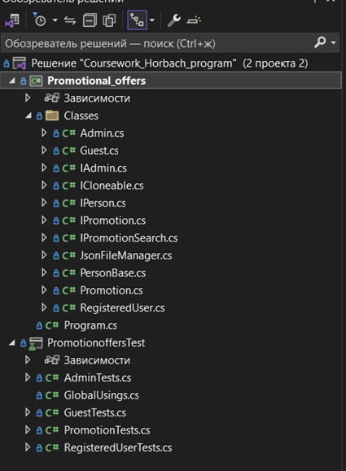

**3.1	Розроблення unit-тестів для класів предметної області**

Повний код розроблених unit-тестів  можна знайти в гілці master в папці PromotionoffersTest.

Таблиця 3.1 – Покриття unit-тестами класу «Admin»:
| Назва методу                   | Кількість розроблених unit-тестів |
|--------------------------------|------------------------------------|
| Authenticate                  | 2                                  |
| CreatePromotion               | 1                                  |
| EditPromotion                 | 1                                  |
| DeletePromotion               | 2                                  |
| GetActivePromotionsAsString   | 2                                  |
| GetDeletedPromotionsAsString  | 2                                  |
| GetRegisteredUsersAsString   | 2                                  |
| SavePromotionsToJson          | 1                                  |
| LoadPromotionsFromJson        | 1                                  |
| SaveDeletedPromotionsToJson   | 1                                  |
| LoadDeletedPromotionsFromJson | 1                                  |

Таблиця 3.2 – Покриття unit-тестами класу «Guest»:
| Назва методу | Кількість розроблених unit-тестів |
|--------------|------------------------------------|
| Register     | 3                                  |
| ViewPromotions | 2                                  |
| SearchPromotions | 4                                 |

Таблиця 3.3 – Покриття unit-тестами класу «Promotion»:
| Назва методу               | Кількість розроблених unit-тестів |
|----------------------------|------------------------------------|
| UsePromotion               | 2                                  |
| CreatePromotion            | 2                                  |
| EditPromotion              | 2                                  |
| DeletePromotion            | 2                                  |
| DisplayDetails             | 2                                  |
| GetActivePromotionsAsString | 2                                 |
| GetDeletedPromotionsAsString | 2                                |
| Clone                      | 1                                  |

Таблиця 3.4 – Покриття unit-тестами класу «RegisteredUser»:
| Назва методу             | Кількість розроблених unit-тестів |
|--------------------------|------------------------------------|
| Authenticate             | 3                                  |
| UsePromotionCode         | 2                                  |
| SearchPromotions         | 4                                  |
| ViewPromotionDetails     | 2                                  |
| GetRegisteredUsersAsString | 2                                |

**3.2	Результати unit-тестування класів предметної області**

**Проходження unit-тестів для класу Guest**

**Проходження unit-тестів для класу Admin**
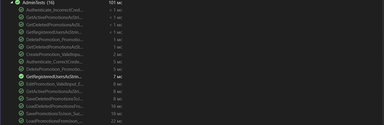

**Проходження unit-тестів для класу RegisteredUser**
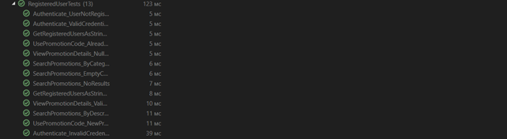

**Проходження unit-тестів для класу Promotion**

# 4.	ПРОЄКТУВАННЯ І ПРОГРАМНА РЕАЛІЗАЦІЯ КЛАСІВ ІНТЕРФЕЙСУ КОРИСТУВАЧА

**4.1	Структура проєкту з реалізацією класів інтерфейсу користувача**

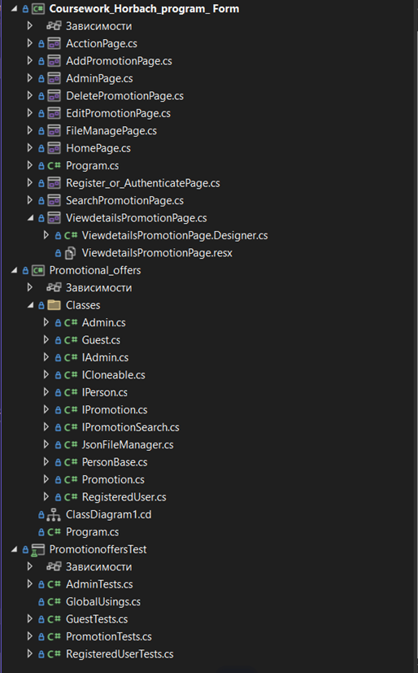

**4.2	Виділення класів для реалізації інтерфейсу користувача**

Елементи сторінки AddPromotionPage

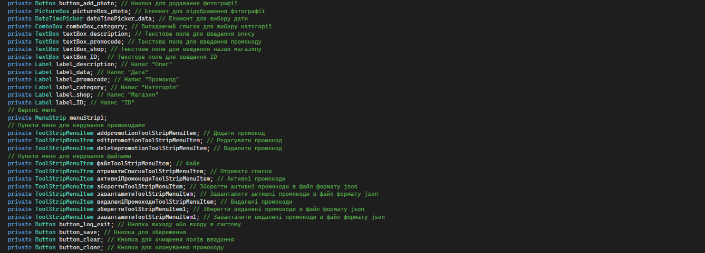

Елементи сторінки AcctionPage

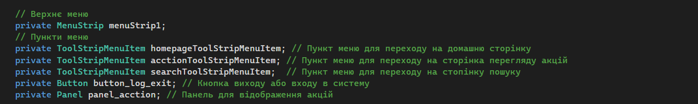

Елементи сторінки DeletePromotionPage

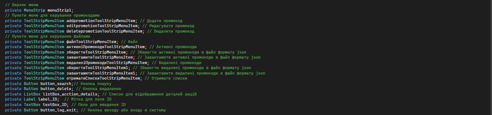

Елементи сторінки EditPromotionPage

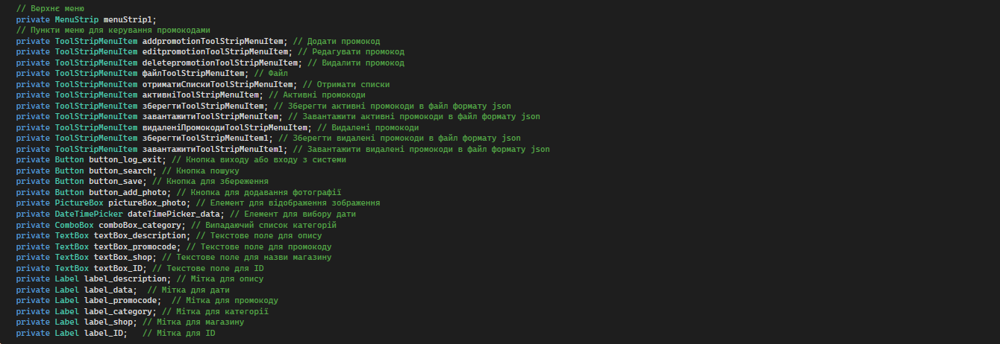

Елементи сторінки AdminPage

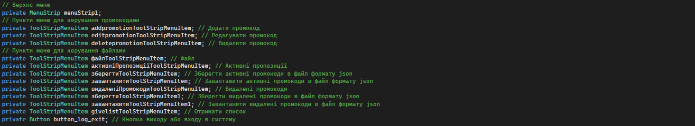

Елементи сторінки Register_or_AuthenticatePage

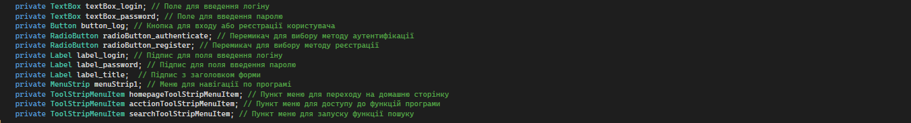

Елементи сторінки SearchPromotionPage

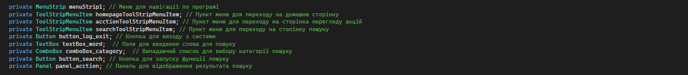

Елементи сторінки FileManagePage

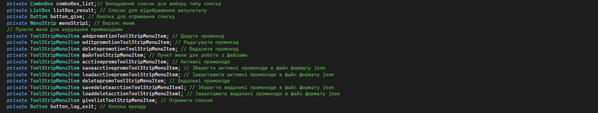

Елементи сторінки ViewdetailsPromotionPage

Елементи сторінки HomePage

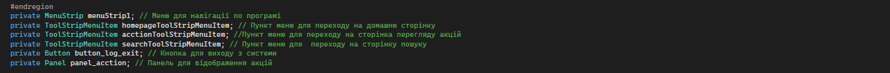

# Програмана реалізація класів інтерфейсу користувача

Повний код реалізації класів інтерфпйсів користувача можна знайти в гілці master в папці Coursework_Horbach_program_ Form.

# ВИСНОВОК

У результаті виконання курсової роботи було розроблено програмне забезпечення з використанням об’єктно-орієнтованої парадигми для предметної області: акційних пропозицій.
В ході роботи було розроблено функціональні вимоги та побудовано модель предметної області у вигляді діаграми класів. Класи були реалізовані з урахуванням обмежень та вимог, і були розроблені unit-тести для їх перевірки. Після цього були розроблені класи інтерфейсу користувача, забезпечуючи зручне використання програми.
